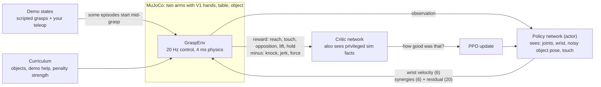

# Teaching the hand to grasp by itself (RL in simulation)

Status: **built 2026-09-29**, first training runs on the laptop. Code: `software/tendra/grasp_env.py`,
`software/tendra/synergy.py`, `software/tendra/rl/`; scripts `sim/train_grasp.py`,
`sim/eval_grasp.py`, `sim/fit_synergies.py`.

## The idea in one picture



**Reinforcement learning (RL)**: the hand tries things, gets a score (reward) per step and slowly
changes its behaviour to get more score. It needs millions of tries, which is why it happens in
simulation. **PPO** is the standard, robust algorithm for this (used for OpenAI's Rubik's cube
hand, NVIDIA's DextrAH, MuJoCo Playground's LEAP hand).

## The arms (added 2026-10-02; floating hand removed the same day)

The wrist is always held by an arm; there is no floating hand any more (owner: "this is the
training standard now"). The robot has **two arms** (OpenArm's shoulder and elbow, then Tendra's
forearm, a forearm twist and a 2-way wrist, `software/tendra/arm.py`, `sim/convert_v1_wrist.py`)
with a right and a **mirrored left** hand (`hardware/cad/mirror_export.py`, `convert_v1.py --side`).
The owner has no arm hardware and won't for a long time, and will probably build their own arm, so
the arm is a **stand-in** and everything is built so it can be swapped:

- **Same interface.** The policy still outputs "move the wrist target + shape the fingers". The
  arm is one layer below: `ArmIK` (damped-least-squares inverse kinematics on a bare kinematic
  copy of one arm, `ik_model(side)`, ~0.2 ms a solve) turns the wrist target into 7 joint targets
  for the arm's position servos. A different arm = a different model + joint list; the policy,
  rewards and fingers don't change.
- **One hand per episode, one policy for both.** `GraspEnvConfig(hands="right"|"left"|"any")`
  picks the working hand each episode; the other arm rests (asleep in the physics, so it costs
  almost nothing). The left hand is seen through a mirror (`scene.canon_pos/vec/rot`, the mirror
  plane is the body's middle): observations, rewards and actions are all in the right hand's
  view, so the same network drives either hand and a left episode equals its mirrored right one
  (tested). OpenArm's left joints 1-3 are sign-flipped so equal angles mean mirrored postures.
  A model that controls both hands at once, like a human, is the later step; "train one hand each"
  comes first.
- **What the arm adds for training the hand:** a wrist that moves like a real one (joint limits,
  speed, a ~30% overshoot on big steps, poses it can't reach). The target may only run 3 cm / 0.3 rad
  ahead of the real wrist, so unreachable targets don't wind up. The actor sees the arm's 7 joint
  angles and speeds; a small penalty keeps joints off their limits.
- **Setup** (`SceneConfig`): the pedestal stands behind the table (y 0.35), shoulders 0.30 m above
  the table top (OpenArm's own height), each arm starts "elbow 90 deg, forearm twisted back
  so the thumb is up" (`POSES["table"]`). Gravity is compensated on the arm (a real arm does that
  in its controller; without it the servos sag 5 mm under the hand). Objects spawn in a box each
  arm reaches (mirrored for the left).
- **Reach, measured** (IK over the scripted grasp's path, right arm): x -0.10…+0.14 m,
  y -0.08…+0.12 m; farther toward the body's middle it runs out of shoulder adduction (OpenArm's
  J2 allows 10 deg). Low objects are the other limit: with a level forearm the wrist can't go
  below ~5 cm, so the **scripted grasp** needs a small pitch and height for the cube and ball
  (`ARM_GRASP`, 8 deg + 1 cm; about 29 of 30 grasps lift with either hand).
- **First arm result** (right arm only, `arm_try1`, before the left arm existed): 400k steps on the
  laptop reached about 87% success.
- **Not done:** the webcam grasp teleop (`sim/grasp_teleop.py`) is disabled (a stub that explains
  why) until it is ported to the arm scene, and the GPU path (`software/tendra/gpu/`, floating
  hand only) raises a clear error (`SceneConfig(contact_sensors=True)` is not implemented). Demos
  come from the scripted grasps (both hands) and from RL rollouts (`eval_grasp.py --record`,
  the side is stored per episode).

## What makes it human-like (the creative part)

| Idea | How it's done here | Why / source |
|---|---|---|
| **Move in synergies, not single joints** | Finger action = 6 synergy coefficients (close, oppose, spread, hook, radial/ulnar roll, thumb curl) + a small, penalised per-joint residual | Human grasps live in a low-dimensional space; 2 synergies explain ~80% (Santello 1998, eigengrasps: Ciocarlie 2009). Smaller search space → faster learning, and odd postures are expensive |
| **Your own eigengrasps** | `sim/fit_synergies.py` runs PCA on your teleop recordings → `--synergies file.npz` | The robot then moves in *your* hand's main patterns |
| **Palm-first approach, grasp zone** | Reward pulls the object into the hand's power-grasp zone (in front of the palm, at the proximal phalanges) with the palm facing it | How humans reach for a cup |
| **Thumb opposition** | Contact reward counts the thumb as much as all fingers; extra reward when contacts are on *opposite sides* of the object (a cheap force-closure proxy) | The thumb is what makes a human grasp |
| **Smooth, calm motion** | Penalties on action change (≈ minimum jerk) and on servo force (grip just hard enough); finger targets low-pass filtered | Humans minimise jerk and effort (Flash & Hogan 1985) |
| **Care** | Penalties for pushing the object around, tilting it, pressing on the table; knocking it over ends the episode | A human doesn't bulldoze the cup |
| **Grasp types** | `--grasp power|precision|any`: precision rewards thumb–index–middle tips and punishes palm contact; the type is an input, so one policy can do both | Feix grasp taxonomy; later an L3 planner can ask for a grasp type |

## What makes it robust (the engineering part)

- **Asymmetric actor-critic:** the critic sees contact forces, exact object pose, mass, friction;
  the actor only what the real robot could know. (Pinto 2018, OpenAI 2019.)
- **Domain randomisation:** object size ±15%, mass ×0.5–2, friction 0.6–1.2, servo stiffness
  ±20%, object-pose noise (3 mm + a per-episode bias) every episode (Tobin 2017).
- **Demo state resets + reverse curriculum:** episodes sometimes start from a random moment of a
  successful grasp (scripted, or your teleop demos via `--dataset`). The hand experiences
  success on day one and learns backwards to the start (Florensa 2017, Nair 2018, Peng 2018).
  The chance fades with the success rate: `demo_prob = 0.5 × (1 − success)`, ≥ 0.05.
- **Object curriculum:** cylinder → + cube → + ball, promoted at 60% success.
- **Penalty curriculum:** penalties start at 30% strength and reach 100% when the last stage is
  mastered. (Run 1 with full penalties learned to keep its hand up and away: not touching
  anything was the safest score. This is a classic RL "local optimum".)
- **PPO details:** observation normalisation, return scaling, GAE, time-limit bootstrapping,
  KL-adaptive learning rate with early stop, bounds loss. All tested (`software/tests/test_rl.py`).
- **Hand-centric observations:** fingertip→object vectors, object in the wrist frame, 6D
  rotations. Similar to RobustDexGrasp's "joint distance vectors", which generalise across shapes.

## Running it

```bash
uv run python sim/train_grasp.py --smoke                       # 30 s check
uv run python sim/train_grasp.py --run runs/grasp --steps 5e6  # a real run (Ctrl-C, re-run = resume)
uv run python sim/eval_grasp.py --run runs/grasp               # success table on fixed spawns
uv run python sim/eval_grasp.py --run runs/grasp --watch       # watch it live
uv run python sim/eval_grasp.py --run runs/grasp --record rl_grasps --episodes 50  # as a dataset
uv run python sim/train_grasp.py --hands right --run runs/right  # one hand only (default: any = both)
```

`runs/<name>/progress.csv` has one row per update (2,048 steps): `success` (normal starts),
`success_demo`, `max_height`, `stage`, `demo_prob`, `penalty_scale`, losses, and the mean of every
reward term (`r_reach`, `r_lift`, ...). Watch `success` and `max_height` go up.

**Speed:** physics is the limit. A free hand costs ~2 ms per control step, a hand holding an
object ~5–7 ms (finger–finger and finger–object mesh contacts plus 40 tendons; cheaper solver
settings made the grip slip, so fidelity stays). The laptop does ~300–650 steps/s with 4
workers, ~1–3 M steps per hour. Grasping usually needs 10–50 M steps → overnight runs, or a
cloud machine with many CPU cores (`--workers 32 --envs 256`, same code).

## Results log

See `research/log.md` (2026-09-29, "Grasp RL"). Fill in each run here too:

| Run | Steps | Change | Success (normal / demo starts) | Notes |
|---|---|---|---|---|
| try1 | 0.13 M | first version | 0% / 17–50% | learned to hold from demo starts; from scratch it kept the hand up and away (penalties) → penalty curriculum, wider reach reward, knocked-over = fail |
| try2 | 0.55 M (stopped: laptop low on memory) | the fixes above, 7 workers (~270 steps/s) | **7% at 0.27 M**, then 1% / 60–68% → 10% | first grasps from normal starts! Then **reward hacking**: success ended the episode (and the holding reward), so it learned to hold the object just *below* the success height. Also a physics blow-up threw an object kilometres. Fixes: success no longer ends the episode, blow-up guard (speed > 3 m/s or > 40 cm up = fail, nothing counts), workers no longer import PyTorch (~630 → ~410 MB per worker) |
| try3 | not started | the try2 fixes | | |

## Next steps (in order)

1. **Longer runs** until the cylinder succeeds from a normal start; then all three objects.
2. **Your teleop demos as demo starts** (`--dataset grasp`) and your own synergies.
3. **Teacher → student:** record thousands of successful RL grasps (`eval_grasp.py --record`),
   render the cameras, and train a *vision* policy (ACT / Diffusion Policy in LeRobot) that
   only sees images + joints. This is how DextrAH-RGB and RobustDexGrasp got to real robots.
4. **Scale:** GPU physics for 10–100× more samples. Checked 2026-09-30: **MuJoCo Warp runs our
   scene correctly** (tendons, meshes, the grasp holds); MJX's JAX backend lacks cylinder–box
   collisions. Speed on a free Colab T4 (`sim/colab/`): **7,055 control steps/s with 4,096 hands**, ~25× the
   laptop, grasps still hold. Next: port the env + PPO to JAX/Warp.
5. **Style prior from demos:** an AMP-style discriminator (Peng 2021) that rewards motion that
   looks like your recorded grasps, instead of hand-written style penalties.
6. **Touch:** servo load readings (see `ideas.md` #6) as observations, like the contact flags now.

## Sources

- Santello, Flanders, Soechting (1998), *Postural hand synergies for tool use*.
- Ciocarlie, Allen (2009), *Hand posture subspaces for dexterous robotic grasping* (eigengrasps).
- Schulman et al. (2017), *Proximal Policy Optimization*; (2016) *GAE*.
- OpenAI (2019), *Solving Rubik's Cube with a Robot Hand* (asymmetric AC, domain randomisation).
- Pinto et al. (2018), *Asymmetric Actor Critic for Image-Based Robot Learning*.
- Rajeswaran et al. (2018), *DAPG: Learning Complex Dexterous Manipulation with Deep RL and Demonstrations*.
- Florensa et al. (2017), *Reverse Curriculum Generation*; Nair et al. (2018), *Overcoming Exploration with Demonstrations*.
- Zhou et al. (2019), *On the Continuity of Rotation Representations in Neural Networks* (6D rotations).
- Peng et al. (2021), *AMP: Adversarial Motion Priors*.
- Zhang et al. (2025), [*RobustDexGrasp*](https://arxiv.org/abs/2504.05287): teacher-student RL, hand-centric shape representation, 94.6% on 512 real objects.
- Singh et al. (2024), [*DextrAH-RGB*](https://arxiv.org/abs/2412.01791): privileged RL teacher distilled into an RGB policy, sim-to-real.
- Zakka et al. (2025), *MuJoCo Playground* (GPU MuJoCo, dexterous sim-to-real).
