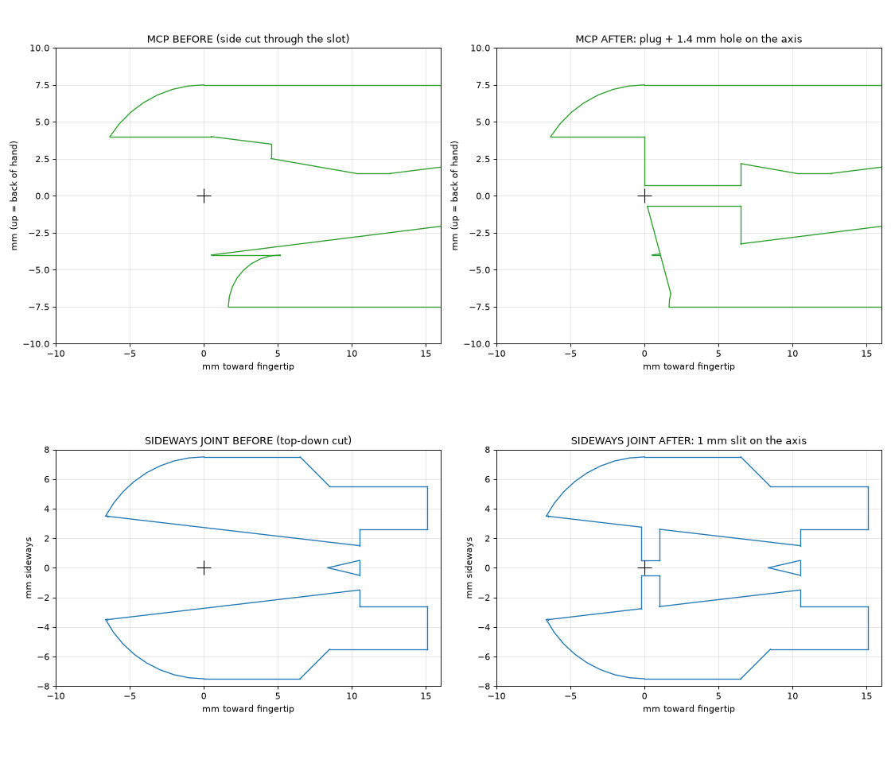
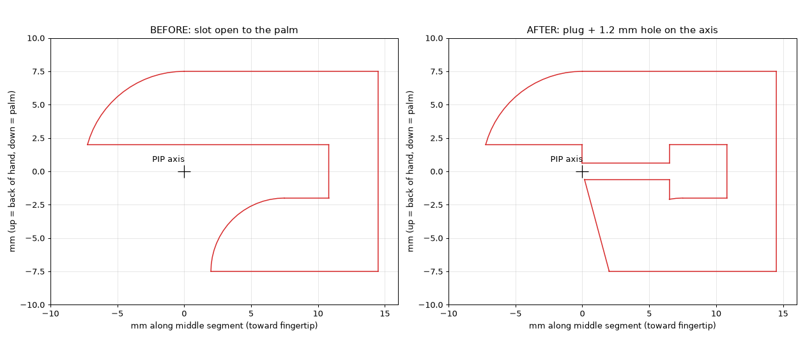

# Research log

Lab notebook for Tendra Hand. Newest entries at the top.

**Entry template**
```
## YYYY-MM-DD: Short title
**Goal:** what I wanted to find out / do
**Setup:** hardware, software versions, settings
**Result:** what happened (numbers, photos, plots)
**Conclusion / next:** what I learned and what to try next
```

## 2026-10-03: Journey page on the website
**Goal:** see the road taken (hardware, software, AI, and the dropped paths) as one picture.
**Setup:** `website/content/journey.json` (done and dropped steps only, 5 lanes, a `why` and `lesson` for each dropped idea), `JourneyMap.tsx`, `JourneyDays.tsx`, `JourneyDropped.tsx`, route `/journey`, nav and sitemap entries, link from the homepage roadmap. Also fixed `roadmap.json` (4-joint thumb).
**Result:** typecheck, lint and build pass. Checked in Chrome on desktop. Phone layout, dark theme and reduced motion are not checked yet.
**Conclusion / next:** keep `journey.json` in step with this log. Run the design, accessibility and code reviewers before committing.

## 2026-10-03: DIP linkage modelled in Fusion
**Goal:** model the rigid PIP→DIP bars in the "Tendra Hand V1" design.
**Setup:** `TendraHandV1.py` stage `linkage` (run through the Fusion MCP; the call timed out but the stage finished).
**Result:** `<finger>_link_plate_a`, `_plate_b` and `_bar` for index, middle, ring, little (bar 21.8 / 24.9 / 23.9 / 17.7 mm), rigid as-built joints to the phalanges, pegs cut into the phalanges. Interference check: 0 collisions in all four fingers.
**Conclusion / next:** the design is not saved or exported yet. Still open in CAD: thumb routing, palm/forearm rebuild for 16 servos (the old DIP servos are still in the design), then re-export and re-run `mirror_export.py` and the converters. Print one index finger to test the linkage.

---

## 2026-10-02: Two arms, a mirrored left hand, no floating hand
**Goal:** owner: "remove the floating hand, this is the training standard now; make the left arm so we have 2 to train it", and a model with both hands like a human, starting with one hand each. Not to start training ("just make it ready").
**Result:**
- Left hand by exact reflection (`hardware/cad/mirror_export.py` → `v1_export_left/`, STL winding reversed; converters take `--side`). Same tendon lengths, limits and masses; fingertips mirror to 0.0 mm (the tip site is now the cap centroid, mirror-safe). Left wrist: `forearm_rot` and `wrist_dev` axes negated. Tested in `sim/tests/test_v1_left.py`.
- One model with both OpenArm arms (`tendra.arm`, `right_`/`left_` names; left J1-J3 sign-flipped so equal angles = mirrored posture). IK runs on a bare kinematic copy (`ik_model`, 0.2 ms, matches the full model).
- `GraspScene` has two arms; the resting one sleeps in the physics. Scripted grasps lift objects with either hand (about 29/30 each). `scene.canon_*` mirror functions map the left hand to the right, so `GraspEnv` (`hands="right|left|any"`) gives the same 141-dim observation for a mirrored left episode (tested; it needed the cube's spawn yaw mirrored too).
- Earlier arm-only run `arm_try1`: 400k steps, about 87% success.
- Disabled until ported (owner's choice): webcam grasp teleop (stub) and the GPU path (clear error).
**Conclusion / next:** no training started. Next: a first two-arm run (`train_grasp.py --hands any`), then one model that controls both hands at once, then port the GPU path and the teleop.

## 2026-10-02: Training the hand on the arm (grasp scene + RL with `--arm`)
**Goal:** the owner has no arm hardware and won't for a long time (probably an own arm later), so the arm is a sim stand-in to train the *hand* on realistic wrist motion. Make it a drop-in: same policy action, swappable arm.
**Result:**
- `tendra.arm.ArmIK` (damped least squares on a private data copy): wrist pose → 7 joint targets, any model/joints/site. The first version missed by 3-5 mm (damping 0.05 + rest pull biased it); damping 0.01, rest gain 0.2 → 0.1 mm.
- `SceneConfig(arm=True)`: OpenArm pedestal behind the table, hand hangs from the elbow, the scene API is unchanged (`wrist_frame`, `wrist_velocity`, `drive_arm`, `arm_positions`...). Gravity compensation on the arm: without it the servos sagged 5 mm under the hand.
- Geometry measured with IK over the scripted grasp's path: with OpenArm's shoulder height (0.30 m above the table) and the elbow straight down, objects beside the hand were out of reach (one 10° of adduction in J2). Starting with the elbow out 20° and the forearm twisted back 20° (keeps the thumb up) widens it to x -0.10…+0.14 m, y -0.08…+0.12 m. A level forearm can't put the wrist below ~5 cm, so the cube and ball need `ARM_GRASP` (8° pitch, +1 cm): cylinder 20/20, cube 18/20, ball 20/20 scripted grasps lift.
- Step response of the arm: ~30% overshoot, settles in 0.3 s; the same at 2 ms and 4 ms physics (stable for the 4 ms RL step).
- `GraspEnv(arm=True)`: obs + 14 (arm angles, speeds), `arm_limits` penalty, target orientation lead 0.3 rad, arm workspace box. ~300 env steps/s vs ~470. `train_grasp.py --arm` trains (smoke run OK, 2,048 steps), `eval_grasp.py` reloads the arm config from the checkpoint, `--record` adds the 7 arm joints to the dataset state/action (30 values; replay into images works).
- 33 new tests (`test_scene_arm.py`, `test_grasp_env_arm.py`, `test_rl.py::test_train_with_the_arm`).
**Conclusion / next:** run a real arm training (compare success with the floating run at equal steps; watch whether the cube/ball reach stage works from the low spawn), then the GPU path and a mirrored left hand for two arms. Webcam teleop with the arm needs a new home pose (the current one, palm to the camera with fingers up, is unreachable).

## 2026-10-02: Arm for the sim: OpenArm shoulder + elbow, Tendra forearm, wrist and hand
**Goal:** put the V1 hand on a real arm model for AI training (owner: use OpenArm's shoulder and elbow, design our own version later; the hand/forearm needs a wrist joint).
**Decisions (owner):** forearm twist + 2-way wrist (7 DOF per arm, like a human and OpenArm); the 32 strands cross the wrist in **PTFE sheaths through a hollow wrist centre**; one right arm first.
**Setup:** OpenArm v2 MuJoCo model (`openarm-mujoco` 2.3.0, Apache-2.0, a dependency, not copied into the repo). Its J5 (forearm twist) motor sits at the bottom of the elbow link, 95.5 mm below the elbow; from J5 to their wrist is 120.5 mm. Our forearm (servo pack) is 123 mm, so it replaces OpenArm's forearm almost 1:1.
**Result:**
- `sim/convert_v1_wrist.py` → `sim/models/tendra_hand_v1_wrist.xml`: `forearm_rot` (± 90°, OpenArm J5 values), `wrist_flex` (−60…+70°) and `wrist_dev` (−30…+20°) on a gimbal whose axes cross at the wrist centre, in a 20 mm gap (like the carpal bones). Wrist actuators and the 50 g gimbal are placeholders.
- Every servo strand goes through one site on the wrist centre (the sheath ideal). Measured: wrist and twist change strand lengths by < 1e-9 m, and a closed hand's finger angles move < 1° while the wrist bends. Friction in bent sheaths is not modelled.
- `tendra.arm`: OpenArm pedestal, right arm J1–J4 (renamed `shoulder_pitch/roll/yaw`, `elbow`), left arm and right forearm/gripper removed, the wrist model bolted to J5's flange (thumb forward, palm facing the body). 5.0 kg, 23 actuators. Poses `rest` and `ready` (elbow 90°: wrist 0.23 m forward, 0.48 m up) are contact-free and hold within 1.2°.
- Known limits: the arm is longer than OpenArm's, so hanging straight down the thumb touches the pedestal (`rest` holds the arm 10° out). Above ~55° wrist flexion with radial deviation, the thumb base hits the forearm: the servo box (91 × 85 mm) is wider than a human forearm.
**Conclusion / next:** drive the arm from the grasp scene / RL env (IK from a wrist target to the 7 joints), then the bimanual pedestal with a mirrored left hand. Hardware: design the hollow gimbal, choose wrist actuators, slim the forearm.

## 2026-10-02: DIP coupling by a rigid linkage instead of a tendon
**Goal:** pick the best mechanism to couple each finger's DIP to its PIP (owner's question).
**Options compared:**
- **Coupling tendon** (what the sim had): an exact ratio, but 2 strands per finger to pretension. Creep and slack make the fingertip loose, and the DIP has no servo to take the slack up.
- **Rigid four-bar linkage:** one bar per finger crossing the middle phalanx. Pin A on the proximal phalanx (back side of the PIP), pin B on the distal phalanx (palm side of the DIP). Nothing to tension, no creep, and a broken bar is easy to swap.
**Result:**
- With pins at 90° (straight up and down), the linkage is very uneven: the DIP stalls at large PIP angles (27° at PIP 90°).
- `hardware/cad/dip_linkage.py` searches each finger's pin radii and angles under these rules: bar inside the phalanx (|y| ≤ 5.5 mm), ≥ 2 mm from both axes, bar-to-crank angles ≥ 30° (no toggle).
- Every finger lands **within 0.6° of 0.75 × PIP over −5…95°**. All four get nearly the same pins: A ≈ 3.5 mm @ 27–36°, B ≈ 4.5 mm @ −78…−81°. Bars: index 21.8, middle 24.9, ring 23.9, little 17.7 mm.
- The sim uses the fitted quartic curve in the joint equality. The bar is a passive tendon whose length stays at the design value: 0.003 mm spread at random poses.
- The first sim version was 0.1 mm off. The pin frame used `w`, which leans 1.4° toward the phalanx's centre of mass; it is now built square to the PIP-DIP line.
- All tests pass. The hub, coupling strands and DIP drum are gone from the model (36 tendons now).
**Conclusion / next:**
- Linkage chosen (owner, 2026-10-02).
- In Fusion: pins of 1.5 mm steel (or a bent 1.2 mm steel wire bar), bar beside the PIP drum groove (or two thin bars), and slots in the middle phalanx base for the bar's swing.
- The 4.5 mm hub and crossing holes from yesterday's plan are dropped.

## 2026-10-01: Decision: V1 goes to 16 servos (DIP coupled to PIP), 5 mm spools, 7 mm knuckle drums
**Goal:** act on the state-of-the-art research (`research/references/hands/README.md` §5).
**Decisions (owner):**
- **Each finger's DIP is coupled to its PIP by a passive coupling tendon.** The DIP drum and its two strands stay, but they are anchored in the proximal phalanx and wrap a fixed hub on the PIP axis. DIP angle = (r_hub / r_dip) × PIP angle. Start at 0.75 (hub r 4.5 mm, DIP drum r 6 mm), human-like; it's one number to change. Shadow, ORCA, LEAP and Tesla all couple the DIP.
- **The thumb IP stays independent.** V1 = **16 servos** (4 fingers × pip, mcp_flex, mcp_abd + 4 thumb), still 20 joints.
- **Spool radius 5 mm on every servo** (one spool part). Finger knuckle (mcp_flex) drum groove at **14 mm diameter (r 7)**, the most that fits. Servo/joint ratio: mcp_flex 1.4, cmc_rot 1.5, others 1.2.
- **Keep the SCS0009** for now (cheap). Expected fingertip force ≈ 4.7 N at stall (was 3.4 N); silicone pads cut the needed force ~3×.
- **Bearings are already on both sides of every joint** (the research's best option for smoothness).
**Next:** implementation plan (firmware, Python, sim, router, CAD), then step-by-step changes with tests.

**Implemented the same day (commit c430c67), everything except the Fusion CAD:**
- **Router:** 32 strands and 16 servos. The finger `mcp_abd` servos moved to the free deeper back slot (`B2`): from the shallow slot, the index abd strand bent at r 14.7 mm, under the 15 mm rule. Min bend is now 17.0 mm.
- **Firmware 0.4.0:** 16 servos, new IDs, `servo_per_joint` 1.4 / 1.5 / 1.2. `thumb_cmc_rot` needs 210 servo degrees, so its `zero_ticks` is 665, not 512. A new host test checks that every joint's range fits inside 0…1023 ticks. 298 checks pass; both builds pass.
- **Sim:**
  - **Physics:** a joint equality (`dip = 0.75 pip`).
  - **Geometry:** passive coupling strands. Their length stays constant along DIP = 0.75 × PIP, to 0.0000 mm at 200 random poses, which proves the hub/drum geometry gives the ratio. Driving the PIP to 80° moves the DIP to 60°.
  - **MuJoCo note:** wrapping a 4.5 mm hub over a 100° range is fragile. With the side site at 45°, the wrap flipped sides at large bends. A sweep found that a side site straight out on the strand's own side, with the crossing point 8 mm along the middle phalanx, works at every angle.
  - **Fixed:** an old bug in the `fist` keyframe. Its qpos was in actuator order, so `index_mcp_abd` got 60°.
- **tendra:**
  - `HandSpec.couplings` / `all_joint_names` / `expand()`. `SimHand.set_positions` also sets the DIPs.
  - `RealHand` refuses firmware that reports 20 joints.
  - Retargeting fits each finger with the coupling. It puts the robot tip closer than a free fit with the DIP dropped (tested).
- **Scene, synergies, RL:** 16 finger values; dataset frames are 23 (was 27). Old datasets and synergy files are refused with a clear error. Old `runs/` checkpoints and GPU export bundles don't fit any more.
- **Tests:** all 245 pass. The `test_grasp_env` reward test picked "fingers closing" from control column 2, which is now `index_mcp_abd`; it now looks the joint up by name.
- **Still to do (Fusion, with the owner):**
  - 5 mm spools (tie hole inside the 4.8 mm groove floor)
  - 7 mm groove on each finger's MCP drum
  - 4.5 mm hub + tie holes on each proximal phalanx
  - crossing holes in the middle phalanx
  - forearm with 16 servos
  - re-export, then re-run `convert_v1.py` and remove the converter's skip of the old DIP servo parts

## 2026-10-01: STS3032 datasheet check
**Goal:** does the Feetech STS3032 sense current/force, as a candidate next to the HLS3606M?
**Setup:** official datasheet STS3032 A/0 (2020-06-08, via Switch Science), shop listings.
**Result:**
- Feedback per datasheet: load, position, speed, voltage, temperature. Current is **not** listed; shops claim a current reading (6.5 mA/unit), unverified.
- Modes: position, closed-loop speed, open-loop speed, step. **No constant-current (force) mode.**
- Gear 1:205, 20.6 g, 25T / 4.95 mm horn: the same mechanical numbers as the HLS3606M (likely the same hardware with different control firmware; not confirmed).
**Conclusion / next:** the HLS3606M stays the pick for the MCP and thumb joints, since only it has the constant-current mode. If an STS3032 is bought, read its present-current register on the bench to settle the current question.

## 2026-09-30: State-of-the-art hands research (1X NEO, humanoids, open-source hands)
**Goal:** find out how the leading hands (1X NEO, Tesla, Figure, ORCA, LEAP, Aero Hand, Shadow…) work, and what makes Tendra smoother, stronger and better.
**Setup:** six parallel research agents (1X, humanoid companies, dexterous/open-source hands, tendon mechanics, sensing, actuators/control) and a fact-check pass against datasheets, papers and repos. Web tools failed for part of the run; unverified claims are tagged in each report. Overview and plan: `research/references/hands/README.md`.
**Result:**
- Tendra V1's layout (forearm motors, one antagonistic loop per joint, tendons on the joint axes) matches 1X NEO and Tesla V3. Halodi/1X's patent WO2018149499A1 uses the same two-cable-per-joint scheme.
- Strength is the main gap: ~3.4 N fingertip (stall) vs ~80 N human tip pinch, 45 N for NEO, ~12 N for Aero Hand Open.
- Feetech HLS3606M: 0.59 N·m at 6 V, current feedback and a constant-current mode, 23 × 12 mm like the SCS0009 (+2.25 mm tall, 25T spline, own memory table). Aero Hand Open already uses it in a tendon hand.
- Firmware check: goals go out at 50 Hz with a fixed goal speed of 600, and each servo's feedback is read only every 40 ms. This likely causes stop–go motion; fixable for free.
- 0.4 mm nylon mono stretches roughly 15× more than 50 lb UHMWPE braid (0.36 mm).
- Printed-edge friction can cost ~70 % of DIP force in a fist.
- The SCS0009 pot is rated for only 100 k cycles.
**Conclusion / next:**
- Do now: firmware smoothness (100 Hz, per-servo goal speed, jerk filter, register tuning), braid tendon on V0, bench tests (friction, stretch, fingertip force, cycles).
- Owner decisions: test 1–2 HLS3606M on the V0 index MCP; DIP–PIP coupling (sim first); MCP drum 7.5 mm / spool 5 mm.
- Commercial hands checked: Shadow = 20 forearm motors + 40 Spectra tendons, one agonist–antagonist pair per spool (Tendra's scheme), DIP–PIP coupled. Fingertip force: Inspire 10 N, PSYONIC 9.3 N pinch, Wuji 15 N, Sharpa Wave 20 N. Allegro, Tesollo and Schunk are still unverified.

## 2026-10-02: First GPU training run: 77% grasp success in 49 minutes
**Goal:** train the grasp policy on a free Colab T4 with MuJoCo Warp + Brax PPO (`software/tendra/gpu/`, notebook from `sim/colab/make_train_notebook.py`).
**Setup:** `TendraGrasp` (JAX twin of `GraspEnv`: same actions, reward and observations; contacts from MuJoCo contact sensors; power grasp only), 2,048 parallel hands, Brax PPO (policy 256-256-128, critic 512-256-128 on privileged obs), phase A = cylinder, 50% demo starts, penalties at 30%. Hand: the old 20-servo V1. Stack: mujoco 3.14, warp-lang 1.17, brax 0.14.2, playground, **jax 0.9** (brax 0.14 breaks on jax ≥ 0.10).
**Result** (run `gpu1`, evaluation = normal starts without demo help):

| Steps | Minutes | Success | Mean lift |
|---|---|---|---|
| 3.7 M | 20 | 0% | 0.05 cm |
| 5.5 M | 27 | 29% | 1.3 cm |
| 7.3 M | 34 | 63% | 3.8 cm |
| 11.0 M | 49 | **77%** | 9.0 cm |

~4,000 env steps/s including learning. The free session then disconnected (weights saved on Drive at 11 M). For comparison, the laptop's CPU run reached 7% at 0.27 M steps after hours.
**Bugs found afterwards:** (1) the bundle export called `scene.reset` *after* making every object collide and float, and the reset switched that off again: cube and ball fell through the table and the cylinder got gravity twice (the run trained with a 2–4× heavy cylinder; it still learned). Fixed (reset first, then configure, plus an assert). (2) Python output through `| grep` in Colab was block-buffered, so no progress showed; now `python -u` + `grep --line-buffered`.
**Conclusion / next:** GPU training works and is ~10–25× faster than the laptop. The hand changed to 16 servos (DIP coupled to PIP) on 2026-10-01, so the next run (`gpu2`) starts fresh with a new bundle (`tendra_gpu_kit_<hash>.zip`; the hash in the name stops Colab from reusing a stale kit) and goes through all three phases (cylinder → all objects → full penalties).

## 2026-09-30: GPU physics check: MuJoCo Warp runs the grasp scene
**Goal:** can the grasp scene run on a GPU (for 10–100× faster RL), before porting anything?
**Setup:** mujoco-mjx 3.14 with both backends, tested on the laptop CPU (no NVIDIA here): `uv run --with "mujoco-mjx==3.14.*" --with "jax[cpu]" --with warp-lang --with mujoco-warp ...`; nothing added to the project's dependencies.
**Result:**
- **MJX (JAX backend): not usable as is.** The model loads, but stepping fails: cylinder–box collisions are not implemented (the cylinder on the table box). A plane table would fix that one; there may be more gaps.
- **MuJoCo Warp (NVIDIA Warp backend): works.** Same result as CPU MuJoCo within 0.0001 rad over 100 steps, and replaying the scripted grasp lifts the cylinder 10 cm like on the CPU; 4 parallel worlds all lift. Needs bigger contact buffers than the default: `naconmax` is for *all* worlds together (96 per world), `njmax` 600 per world.
- Speed is unknown until it runs on an NVIDIA GPU: `sim/colab/make_bench_file.py` writes `runs/colab/tendra_warp_bench.npz` (compiled scene + one grasp, 3.7 MB) and a Colab notebook that measures control steps/s for 256/1024/4096 hands on a free T4.
- **Colab T4 benchmark (free GPU, 2026-10-01)**, the whole run is the contact-heavy grasp-and-lift phase, 12 substeps per control step:

  | Parallel hands | Control steps/s | Compile | Lifted |
  |---|---|---|---|
  | 256 | 2,966 | 291 s (first, incl. Warp kernels) | 100% |
  | 1,024 | 6,146 | 14 s | 100% |
  | 4,096 | 7,055 | 45 s | 100% |

  The laptop trains at ~270 steps/s on average and manages ~150–200 per core while holding an object, so the T4 is **~25× faster**. It saturates around 4,096 hands; physics for 5 M steps ≈ 12 min instead of ~5 h.
**Conclusion / next:** worth it. Port `GraspEnv` (reward, observations, resets in JAX) and PPO to a JAX + MuJoCo Warp version that trains on Colab, checked against the CPU env.

## 2026-09-29: Grasp RL: the hand learns to grasp by itself (system built)
**Goal:** a robust training system in which the simulated V1 hand learns to pick up objects on its own, in a human-like way, as the next AI step after teleop demos.
**Setup:** `tendra.grasp_env.GraspEnv` on the grasp scene (20 Hz control, 4 ms physics) → PPO (`tendra.rl`, PyTorch 2.14 CPU, added as the default `train` group) with 32 envs in worker processes. Design, research basis and sources: `research/ai/grasp-rl.md`.
- Action = wrist velocity + 6 hand synergies (close, oppose, spread, hook, roll, thumb curl; "close" = the scripted power grasp) + a penalised per-joint residual. `sim/fit_synergies.py` fits synergies to teleop demos instead (PCA).
- Reward: object into the power-grasp zone with the palm facing it, fingertips to its surface, thumb + fingers touching, opposition (contacts on opposite sides), lift, hold 0.5 s at 6 cm = success. Penalties: action change, residual, servo force, pushing/tilting the object, hand on the table; knocked over / pushed away = fail.
- Asymmetric critic (contact forces, clean pose, mass, friction), domain randomisation (size, mass, friction, servo stiffness, pose noise), demo-state starts from scripted grasps (43/60 succeed: cylinder 20, ball 20, cube 3) or teleop datasets, curriculum over objects, demo help and penalty strength.
**Result:**
- Physics sets the speed: a free hand ~2 ms per control step, a held object ~5–7 ms (MuJoCo timers: ~⅓ collision narrow phase, ~⅓ kinematics incl. 40 spatial tendons, ~⅕ solver). Fewer solver iterations (≤ 20) or pyramidal cones make the grip slip, and disabling finger self-collision loses the grasp, so full fidelity stays. 4 workers use only ~50% of the CPU (4 cores / 8 threads); 7 workers use the hyperthreads.
- Run try1 (full penalties from the start, 0.13 M steps): it learned to *hold* from demo starts (17–50% success), but from a normal start it lifted the hand up and away. Touching nothing was the safest score (a toppled cylinder cost −1 every step for the rest of the episode). Fixes: penalties start at 30% and grow with success, a wide + narrow reach term (pulls from 20 cm away), knocked over = one-time fail.
- Run try2 (with the fixes, 7 workers, ~270 steps/s): after 0.09 M steps it holds from demo starts 60–68% of the time; from normal starts it now goes down toward the object (closest 0.9 cm from the grasp zone) instead of fleeing, no grasp yet. Update: stopped at 0.55 M steps (laptop low on memory). At 0.27 M it grasped from normal starts 7% of the time, then fell to 1% by **reward hacking**: success ended the episode and with it the per-step holding reward, so hovering just below the success height scored more. Also one physics blow-up launched an object kilometres. Fixed: success no longer ends the episode, a blow-up guard, and workers no longer import PyTorch (~630 → ~410 MB each). Lesson: every way an episode can end changes what the policy wants.
**Conclusion / next:** the system works end to end (22 new tests: env, synergies, PPO bandit, GAE, curriculum, workers, train + resume). Grasping from scratch needs long runs (10–50 M steps ≈ overnight on the laptop, or a many-core cloud machine). Next: long run on the cylinder, then teleop demos as demo starts, then RL teacher → vision student.

## 2026-09-29: First real-hand test setup (V0 index)
**Goal:** drive the printed V0 index finger from sliders and from webcam teleop.
**Setup:** ESP32-S3 on COM4, 4 × 28BYJ-48 + ULN2003 on the index. Motor 3 (`index_mcp_flex`) is wired to **8, 14, 46, 9** (was 8, 3, 14, 9 in config.h; GPIO 3 is now free). New `software/tendra/calibration_v0.json` + `tendra.calibration`: scales and speed are sent on every connect by `sim/twin.py` / `sim/teleop.py`, because the firmware forgets `K`/`V` on reset. Start values: 389.2 half-steps per joint rad for all 4 index joints (6 mm drum / 10 mm spool estimate), 1 rad/s, 3 rad/s².
**Result:** firmware built and flashed; the board answers `I`/`S`, nothing moves at boot. Motor directions not checked yet.
**Update:** at 389.2 the joints moved too little (owner: "about 2× more"), so all 4 index scales are now **778.4** steps/rad (motor turns ~1.2× the joint angle). Either the drum lever arm is larger than 6 mm or line stretch/slack eats part of the motion; measure per joint.
**Conclusion / next:** check each motor's direction with a small raw move (set `invert` in config.h where needed), then measure real steps/rad per joint and update the JSON.

---

## 2026-09-29: V0 index knuckle bends easily but extends hard; 5 mm spool
**Goal:** owner: on the real V0 prototype, the index MCP (3rd joint from the tip) is hard to drag: it bends easily but extends hardly. Make it easier and able to pull harder and grab things.
**Setup:** the printed geometry (the joint-zero STEP from commit 8a004b5, before the pinch-point changes), sliced at the MCP drum with `research/experiments/2026-09-27-index-pinch/mapper.py`; firmware `include/config.h`.
**Result:**
- The printed index still has the old knuckle routing. The MCP's own loop runs on a drum of r ≈ 5.7 mm, and below it the strands squeeze through a ~4.5 mm funnel in the knuckle base; the PIP/DIP strands cross the knuckle in a slot open to the palm, not on the axis. So moving the knuckle changes their length (coupling) and drags them over funnel edges. That's the likely reason extension is hard; the on-axis version (TendraIndexPinch / TendraPipPinch) is designed but not printed.
- The motor side is weak too: 800 half-steps/s default (near the 28BYJ-48's top speed, where its torque collapses), coils released after 1 s (a grasp isn't held), 10 mm spool (~3 N of tendon pull).
- Suggested test: `R`, loosen the PIP and DIP loops at their spools, move the knuckle by hand. Easy now → the pass-through tendons (print the updated index). Still hard → the knuckle's own loop (tension, funnel friction).
- **Made (owner's pick):** `hardware/cad/spool_v0.py` → `hardware/print/v0/spool_r5.stl`, a 5 mm spool (2× the pull, half the speed): two grooves, tie holes, double-D bore; watertight, sections checked. Not changed (offered): slower default speed, a hold command, exporting the updated index STLs.
**Conclusion / next:** print the spool, re-calibrate the knuckle (about 2× steps per radian), and run the test above to see whether the updated index parts are needed too.

## 2026-09-29: V1 back to a 4-DOF thumb (20 DOF), thumb tendon lengths checked
**Goal:** owner: remove the 5th thumb joint that was added (`thumb_mcp_abd`, a hinge in the proximal phalanx), and make sure every thumb tendon keeps the same length at every thumb angle.
**Setup:** Fusion design "Tendra Hand V1" (stage `thumb_unhinge`), router, sim, firmware, Python.
**Result:**
- **CAD:** the prototype's one-piece proximal phalanx was recovered from the timeline (the hidden raw body), moved onto the V1 thumb's axes (135° about Y; its MCP and IP axes land exactly on the V1 axes, same bounding box as the hinged parts) and put back as `thumb_proximal`, with the `thumb_mcp_flex` and `thumb_ip` joints. The hinge parts and the `thumb_mcp_abd` joint are gone. No interference at q = 0; mcp_flex and ip swept clear over their ranges. Export: 64 parts, 20 joints.
- **Servo IDs renumbered 1–20** (owner's choice): middle 9–12, ring 13–16, little 17–20. Firmware 0.3.0 (`kNumJoints = 20`), both envs build, 333 host checks pass. Python `V1` spec, fake ESP32, scene, tests and the sim updated. The thumb's F3 servo slot is free now.
- **Tendon lengths:** new test `test_thumb_tendons_keep_their_length_at_every_thumb_angle` (sim/tests/test_v1.py) runs all 8 thumb strands over a 5 × 5 × 5 × 5 grid of the 4 thumb joints: length change from the other joints ≤ 1e-13 mm, loop length constant. This checks the model, where every crossing sits exactly on its joint axis.
- **Finding (physical routing):** the 2-D voxel map of the metacarpal (0.5 mm, from Fusion) shows its front half is thin (a central channel, top at z ≈ 13). The sheath loop can only arrive at the metacarpal at ~45° up-forward (a flatter entry gives < 10 mm bend radius over the cmc_flex range), and from there the tubes can't turn down to where the strands must run. The routing downstream of the tube stops is clear (ip strands in the central channel, crossing MCP through a 1.2 mm hole on the axis; mcp_flex strands straight to the MCP drum's sides), but getting the tubes there needs a reshaped metacarpal.
- Full test suite passes.
**Conclusion / next:** rebuild palm + forearm in Fusion from the 20-servo routes (the owner removes the old features by hand again), then decide how the sheaths enter the metacarpal (reshape it, or end the sheaths on the base).

## 2026-09-29: Thumb tendon routing, design study (V1)
**Goal:** close V1's last open routing item: get the 10 thumb strands from the bay floor to their drums.
**Setup:** Fusion design "Tendra Hand V1" via the Fusion MCP (read-only sections, 1 mm grid). Owner's choice: PTFE sheaths through the 2-axis thumb base, on-axis crossings further out. Details: `research/experiments/2026-09-29-thumb-routing/`.
**Result:**
- The thumb base is a frame (bottom plate, side walls, top arm, 4 mm pins top and bottom). The metacarpal sits right on the plate; the only free space is inside the frame, behind the metacarpal. The cmc_flex axis is 5.5 mm in front of the cmc_rot axis.
- **No path for sheaths** in the current base: anything crossing from the palm into the rotating frame is cut, except along the rot axis, and that's blocked by the solid bottom pin.
- **Bug:** the two `cmc_rot` strands rise vertically from the floor, parallel to the rot axis, so they can't turn the base. They must reach the drum groove horizontally. The MuJoCo model hides this with a virtual guide point on the palm.
- Two concepts: **A** rework the base (hollow bottom journal, tubes up the rot axis, room to loop them into the metacarpal, horizontal feed for cmc_rot); **B** an outside tube loop from the palm edge to the metacarpal (ORCA style, needs ~100 mm slack).
- Owner chose **A**. A 2D loop search (`sheath_loop_search.py`) sized it: with the base plate and bay floor lowered **4 mm** along the rot axis (no kinematic change), the tubes can rise up the hollow pivot, bow over and enter a boss on the metacarpal's top (just above the cmc_flex axis, 45° up-forward), with a worst-case bend radius of **15.5 mm** over the whole cmc_flex range (11.0 mm without lowering).
**Conclusion / next:** build in 6 tested stages (router → base → palm → metacarpal → on-axis holes → export + checks), listed in the experiment README.
- **Stage 1 done (same day):** the router now has the whole thumb base: hollow journal (bore Ø11.6), cmc_rot drum r 7.5 fed horizontally over a Ø3 pin in the palm (**servo_per_joint 1.25**, firmware and sim updated; sim ctrl is now the joint angle for every joint), cmc_flex drum over the rot axis with a Ø3 pin on a hanger, sheaths in 2 × 3 in the bore to a split boss on the metacarpal (loop bend ≥ 14.3 mm, no crossing), bare cmc_flex strands held under their mid-range position (≤ 0.25 mm length change over −100…40°). Thumb servos re-slotted (6 → F1, 7 → F2, 8 → B1). 13 new tests; full suite 191 passed.
- **Stage 2 done:** the owner removed the old palm/forearm features by hand (the bulk delete was refused by the permission check); `thumb_base`, `palm`, `forearm` rebuilt from the new routes. **Stage 3a:** cmc_flex drum on the metacarpal (`thumb_meta`). Checks: 65 parts, 0 interferences at q = 0; cmc_rot −100…40 and cmc_flex −13…80 swept clear. The sweep caught two contacts (hanger corner in the drum flange, metacarpal top at 130…150°), both fixed. Next: metacarpal socket boss + internal sheath channels.

## 2026-09-29: One place for project media
**Goal:** a single folder for photos and videos that the website, the READMEs and Claude can all use.
**Setup:** new top-level `media/` (`photos/`, `videos/`, `screenshots/`, `diagrams/`, `catalog.json`, git-ignored `inbox/`), `media/process_inbox.py` (Pillow), website copy via `scripts/sync-styleguide.mjs`.
**Result:** tested with a fake 4000×3000 phone photo with GPS, rotation and date in its EXIF data. It came out upright at 1500×2000, with no EXIF, named by the date it was taken and catalogued. The website copy lands in `public/media/`.
**Conclusion / next:** drop the first real photos of the V0 prototype in `media/inbox/` and replace the gallery placeholders.

## 2026-09-29: Easier reaching in grasp teleop
**Goal:** the owner's first try: grasping mostly worked, but reaching the object meant moving the real hand out of the webcam image or very close to it.
**Result:**
- **Why:** the sim wrist started 20 cm up, with the objects in front of it. The view camera looks down at ~25°, so reaching the table meant moving the real hand ~17 cm down in the image. At 0.5 m that puts the palm at the bottom edge. The start pose was also absolute: the operator had to hold their hand exactly at 0.5 m.
- **Changes:**
  - The hand starts lower and nearer the objects (home (0, 0.02, 0.15)).
  - Wrist gain 1.6× sideways and up/down, 2× toward/away from the camera (per-axis `gain` in `WristTracker`).
  - The first tracked frame is home wherever the hand is (`WristTracker.recenter()`); **E** re-centres at any time.
  - A comfort box on the camera image, with warnings near the image edges, closer than 0.30 m or farther than 0.85 m.
  - View camera closer (fovy 60).
- **Bug found:** at the lower home, the **forearm reaches ~10 cm in front of the wrist** (the servo pack is on the palm side; measured y -0.128 at home). A cylinder spawned against it was knocked over. Moving home back 5 cm leaves ≥ 1.5 cm clearance. `test_scene` now checks 20 spawns per object: upright, on the table, not touching the hand. The first test only tried one spawn per object and missed it.
- 222 tests pass.
**Conclusion / next:** owner re-tests reaching. Still open: the forearm/servo pack is bulky for low grasps, which matters for the real arm-mounted design too.
- **Follow-up (owner screenshot: real hand low, sim hand still high):**
  - The mirror mapping used the view camera's tilted axes (~30° down), so moving the real hand toward the webcam also lifted the sim hand, doubled by the depth gain. `view_basis` is now levelled: up = world up, toward the camera = horizontal.
  - The tracker followed the palm centre while the sim moves `hand_root` at the wrist, so turning the palm down shifted the sim wrist ~5 cm. It now tracks landmark 0, the wrist.
  - 222 tests pass.
- **Follow-up 2 (owner: real hand had to come too close to the webcam; the twin looked far away):** objects now spawn **beside** the hand (|x| 0.09–0.15 m, random side, at about the hand's depth) instead of in front of it. Reaching is then sideways + down, which a webcam tracks well, instead of toward the camera. (With the new 4-DOF thumb, the hand reaches forward to y -0.095 at home, so objects could not simply come closer in front.) The view camera is ~0.4 m from the hand instead of 0.48 m. The scripted grasp lifts the cylinder on both sides (6/6).

## 2026-09-29: Grasp demos in simulation: floating hand, wrist tracking, recorder
**Goal:** let the operator pick objects up in the sim (fingers alone can't: there is no arm yet) and record demonstrations for imitation learning.
**Setup:** built by three parallel agents with fixed interfaces, then integrated: `tendra/scene.py`, `tendra/wrist.py`, `tendra/dataset.py`, `sim/export_lerobot.py`, `sim/grasp_teleop.py`.
**Result:**
- **Floating hand.** `MjSpec.attach` puts the whole V1 hand (fixed parts, 21 joints, 42 tendons, actuators, excludes) into a free body `hand_root` at the wrist point, model (-33.5, 26, -30) mm. It is welded (solref 0.02/1) to a mocap target, an ideal arm that stands in for the real one. Tracking: a 7.8 cm move plus a 45° turn settles within 3 mm and 2° in 0.4 s; the hand sags 0.5 mm at home. Physics: implicitfast, elliptic cones, impratio 10, lite meshes.
- **Objects:** cylinder r 22 mm × 90 mm (50 g), cube 40 mm (40 g), ball r 28 mm (40 g); friction 1, condim 4. Spawn between the hand and the view camera.
- **Scripted side power grasp** (fingers 1.4/1.5/1.2 rad, thumb cmc_flex 1.2) lifts the cylinder 10 cm and holds it 2 s, with the **real SCS0009 limits** (actuators saturated at 0.095 N·m; about 30 N of total squeeze on 0.49 N of weight). It worked for all 7 spawn seeds tried. The forearm and servo pack hit the table in low grasps.
- **Wrist from the webcam:** MediaPipe's 3D landmarks carry the hand's rotation relative to the camera, so only the translation T is unknown. It is found by Gauss-Newton on the pinhole reprojection (42 residuals, 3 unknowns, palm points weighted 1, fingers 0.3), started from a weak-perspective guess. On synthetic hands with 2 px + 3 mm noise: sideways error median 1.8 mm (95 %: 5 mm), depth error 1.2 % (95 %: 3.7 %); depth jitter 2.3 mm after smoothing; 1.8 ms per frame. The view frame is a mirror (reflection); a real left hand matches the right robot exactly, a real right hand drives its mirror image. Clutch (W) like lifting a mouse. Unknowns: webcam FOV (62° assumed) and the user's hand size (MediaPipe assumes an average hand); both only scale absolute depth.
- **Recorder:** only the sim state is recorded (qpos, qvel, ctrl, mocap, state, action, landmarks, object pose), at 30 fps sim time, 38 µs per frame. Images are rendered afterwards by replay: one render costs ~25 ms here, too slow to do live. The compiled model is saved as `model.mjb` in each dataset (identical across builds, checked). Files are written atomically (temp + rename).
- **LeRobot export** tested for real: lerobot 0.6.1, dataset v3.0, needs `lerobot[dataset]`, AV1 video, serial encoding (the parallel encoder is ~20 s per episode on Windows). torchcodec DLLs fail on Windows, but PyAV takes over.
- **End-to-end test** without a webcam: the scripted grasp goes through the teleop recording code, is saved as a success, then replayed and rendered from both cameras into an MP4. 221 tests in total.
**Conclusion / next:** owner records ~50 demos (`uv run python sim/grasp_teleop.py`), then we export and train ACT on a free cloud GPU. Open: calibrate the webcam FOV, a per-user hand scale, and whether cube and ball are graspable by hand.

## 2026-09-29: Teleop screenshots: sideways angles, mirrored view
**Goal:** check the owner's three teleop screenshots (open hand, spread hand, rock sign; the owner used the **left** hand). They are in `media/inbox/` and are not committed: one shows faces (see `media/README.md` rules).
**Result:**
- Tracking looked solid (20–23 fps, 57–72 ms delay), and the rock sign came out roughly right.
- **Abduction reference was wrong.** Sideways angles were measured from each finger's wrist → knuckle line. On a human hand those lines fan out (index ≈ 37° in screenshot 2), so a spread index read ≈ 0° and fingers held together read as bent toward the middle. The robot showed the index and middle converging while the human's spread. Now every finger is measured from the palm's up axis, which matches Tendra (fingers parallel at `mcp_abd` = 0).
- **Abduction fades with flexion:** robot `mcp_abd` = human abduction × cos(MCP flexion), because the collateral ligaments stop sideways motion near 90° of knuckle bend. This also keeps curled fingers from converging into each other.
- **View:** the robot (a right hand) is shown mirrored only when a right hand is tracked, so it always looks like the hand in the mirrored camera image. Status text now sits on a dark bar; **D** shows every joint target in degrees.
**Conclusion / next:** owner re-tests: spread vs together, fist, and compares the D readout with their own hand.

## 2026-09-29: Fist bug fixed, more precise finger maths
**Goal:** the owner's test: closing the hand into a fist made every finger go straight, as if they bent backwards. Also make the joint angles more precise.
**Setup:** `software/tendra/retarget.py`; synthetic hands with known angles, random rotations, left and right hands, 2–3 mm Gaussian landmark noise (webcam-like).
**Result:**
- **Cause:** the palm side was found each frame from `sum(dir(DIP-PIP) - dir(PIP-MCP))`, the direction the PIP joints bend toward. In a fist the fingertips point back at the wrist, so that sum flips and the palm is taken to face the other way. Every angle becomes negative and is clipped to -5 deg ("straight"). Reproduced by a new test first (4/4 failing).
- **Fix: bend-axis cue.** For successive bones a, b: (a x b) . x = +sin(bend) on a right hand (x = thumb-side axis) for any bend from 0 to 180 deg, and negative on a mirrored hand. Summed over all 12 finger joints, it keeps its sign in a fist.
- **Palm plane:** least-squares plane (SVD) through the wrist and all four knuckles, instead of three points.
- **Finger model fit:** each finger is a small model (MCP = sideways, then flexion; PIP/DIP hinges; one bending plane). Gauss-Newton with light Levenberg-Marquardt damping fits (abd, mcp, pip, dip) to the PIP, DIP and tip landmarks, starting from the closed-form estimate or last frame's fit, whichever fits better. Analytic Jacobian, checked against finite differences. All four fingers are fitted in one batched NumPy computation. PIP/DIP in the closed form are now signed angles about the hinge axis, with the bones projected onto the bending plane.
- **Bone lengths:** running average (rate 0.05), since bones don't change length. Known lengths cut the error by a further 0.5–1 deg in simulation.
- **Precision** (3 mm noise, mean abs error, deg, [abd, mcp, pip, dip]): relaxed hand, direct [7.0 6.0 10.7 14.4] vs fit [5.9 6.1 11.2 15.2] (about equal); **fist, direct [13.6 6.5 9.8 13.8] vs fit [5.6 4.8 8.7 12.0]** (sideways error more than halved). The remaining error is noise on short bones (22 mm fingertip bone); the One Euro filter smooths it over time.
- **Speed:** a 1e-3 rad stop tolerance (far below the noise) and the batched fit give ~7.5 ms per frame for v1 (was 6 ms with the less precise method). Measurements earlier that day were distorted: Bambu Studio and Fusion 360 held the CPU at 100 %.
- Tests: 25 retargeting tests (fist regression, Jacobian vs finite differences, fit beats the direct estimate in a noisy fist, bend cue sign), 178 total.
**Conclusion / next:** owner re-tests the fist. Remaining limit: the robot's PIP stops at 95 deg, while a human fist reaches ~100–110 deg (clipped). Next precision step would be a temporal model (e.g. a Kalman filter on the joint angles with a motion model) instead of per-frame fits + One Euro.

## 2026-09-29: Faster hand model in teleop (drawing, not maths, was the bottleneck)
**Goal:** tracking now felt fast and accurate, but the MuJoCo hand lagged behind.
**Setup:** benchmarks on the i3-1125G4 with Intel UHD: MuJoCo 3.14 offscreen renderer and the passive viewer, v1 model.
**Result:**
- Cheap parts: kinematic pose update (`mj_forward`) 0.19 ms, physics 1.2 ms per 60 Hz frame, retargeting 6 ms.
- **Drawing was the problem.** One v1 frame (offscreen, 640×480): 2,050 ms with shadows and reflections, 770 ms without. Of that, the **42 tendons** are ~2,000 capsule segments at 28×16 slices each: hiding them gives 70 ms. The meshes have 238k triangles (palm 71k from the channels, forearm 56k, spools 34k). Simplified to 15 % (43k, `tendra.lite_model`, fast-simplification) plus tendons hidden: **21 ms**.
- **The CPU and integrated GPU share one power budget.** The hand network alone runs at 28 fps. With MuJoCo's viewer open and idle: 17 fps. Viewer + lite meshes + pose updates: **7 fps**. The cheaper each frame, the more frames the viewer draws (it redraws nonstop, with no rate cap in the API), and the more it throttles the CPU.
- Fix: teleop draws the hand itself next to the camera image (`tendra.hand_view`), only when the pose changed and at most 30 fps. Network speed with this view: 23–26 fps. Kinematic mode (joints set straight from tracking) by default, so the servo simulation adds no lag; `--physics` keeps it. The in-between gliding was removed: with readings at 20–28/s and drawing at ≤ 30 fps it only added ~25–50 ms of delay.
- A render costs ~20 ms no matter the size (240 px: 15 ms, 480 px: 20 ms), so it's a fixed GPU round trip, not pixels.
- Tests: `software/tests/test_lite_model.py` (same structure, masses and kinematics, < 30 % of the triangles). 170 passed.
**Conclusion / next:** measurements without a hand in view vary run to run (palm detection on every frame). Owner to re-test with their hand. If more speed is needed: a lighter hand-tracking model, or rendering in its own thread.

## 2026-09-29: Smoother webcam teleop
**Goal:** the owner's first live test worked (the twin follows their hand) but felt slow and laggy.
**Setup:** profiled each stage on the i3-1125G4 (v1 model).
**Result:**
- Everything ran one after another in one loop: waiting for a camera frame ~34 ms, network 20–45 ms, retargeting 6 ms, physics (v1: 0.25–0.65 ms per 2 ms step). So the whole loop, including the MuJoCo view, updated only ~10 times per second.
- Not the cause: the simulated servos (v1 reaches 90 % of a 60° step in 70 ms), the 1,966 hidden routing sites (not drawn), and the GIL (MediaPipe releases it; the main thread still gets ~600 turns/s while it runs).
- Fix: three threads. The camera grabs frames (`CameraStream`), a tracking thread runs the network and retargeting on the newest frame, and the main loop steps physics and syncs the viewer at up to 60 Hz with the latest targets, keeping sim time in step with wall time.
- One Euro filter 1.5 Hz / β 0.4 → 2.0 Hz / β 0.8: lag on a 1 Hz motion 67 → 33 ms, jitter at rest 0.34 → 0.35° (simulated noise).
- Measured (no hand in view, so the palm detector runs on every frame, the slowest case): main loop 41–46 Hz (was ~10), hand updates 18–21/s (was ~10), camera-to-targets delay ~65 ms. The app prints these numbers when it closes.
**Conclusion / next:** owner re-tests. If it's still not smooth: interpolate targets between hand updates, and check whether the webcam drops to 15 fps in dim light (auto exposure).

## 2026-09-28: Webcam teleoperation of the digital twin
**Goal:** move the MuJoCo Tendra hand with your own hand in front of a webcam (Stage A in `research/ai/roadmap.md`).
**Setup:** MediaPipe 1.0.1 Hand Landmarker (pretrained, float16 model, CPU) + OpenCV 5; `software/tendra/retarget.py`, `software/tendra/hand_tracking.py`, `sim/teleop.py`.
**Result:**
- **Fingers:** joint angles measured straight from the 3D landmarks. MCP flexion is the bone's elevation out of the palm plane; abduction is its direction within that plane; PIP/DIP are signed bends about the finger's hinge axis. Synthetic hands with known angles, in random rotations and as left or right hands, come back exact (1e-6 rad).
- **Thumb:** the Tendra thumb points straight out of the palm at q = 0, so it can't copy human angles. Damped least squares on the MuJoCo Jacobians matches the thumb's MCP, IP and tip (weights 0.3/0.6/1.0) to the human ones, scaled by MCP→IP→tip length. Scaling from the base was wrong: the two thumb-base axes don't meet, so base→MCP changes with the pose. A robot thumb pose fed back in is recovered within 1 mm.
- **Pinch:** when the human thumb and index tips are closer than 5 cm, the tip target blends toward the robot's index tip. From a cold start it reaches 1–4.5 mm in one frame. **Finding:** Tendra can only pinch with a curled index (an "O" pinch). With the index at (34°, 34°, 17°) the thumb gets no closer than 24 mm (v0 and v1), so the thumb's reach is worth a look in the next thumb revision.
- **Palm side:** MediaPipe's left/right label assumes a mirrored image, so it's the opposite on a normal webcam. We only use it as a first guess; the palm side comes from the direction the PIP joints bend.
- **Smoothing:** One Euro filter (min cutoff 1.5 Hz, beta 0.4). Calibration: press C with the hand open and flat.
- **Speed (i3-1125G4):** retargeting 3.7 ms (v0) / 6.1 ms (v1) per frame. The network takes 42 ms per frame while looking for a hand (~10 fps incl. camera). The first run's camera frame was dark (mean 11/255), so no live hand has been tracked yet.
- Tests: 17 new tests in `software/tests/test_retarget.py`.
**Conclusion / next:** owner's live test: check that the palm side is detected, that the MCP-flex zero is right after calibrating, and how the filter feels. Then record teleop sessions to the LeRobot dataset format (the first data for imitation learning) and try `--fake` / the real v0 hand.

## 2026-09-28: Embodied-AI research hub and the bimanual pole robot
**Goal:** start long-term research on the AI system that will control two arms with two Tendra hands on a pole, and gather resources and ideas.
**Setup:** new folder `research/ai/` (desk research, no experiments yet).
**Result:**
- **Body:** fixed pole (aluminium extrusion) with an optional linear lift, 2 × 7-DOF arms, 2 × Tendra V1 hands (left one mirrored), a head camera and one wrist camera per hand. About 59 DOF in total.
- **Brain:** four layers, like Helix / GR00T / π0.5: L3 language planner (~1 Hz) → L2 visuomotor policy (10–50 Hz, ACT / Diffusion Policy / VLA) plus RL skills trained in sim → L1 whole-body controller (IK, safety, 100–500 Hz) → L0 firmware (exists).
- **Main conclusion:** data is the bottleneck, not algorithms. Record everything in LeRobot format.
- **Stages A–E**, plus a benchmark ladder of 9 tasks. Start the AI stack now on a cheap SO-101 arm with a gripper, separate from the hand hardware.
- **Creative bets** (`ideas.md`): a kinematic-twin data glove, robot-free data collection, pretraining on your own egocentric video, fingertip force estimated from servo load through the tendon Jacobian, self-reset for overnight practice, an LLM that calls skills as tools, and co-design of the hand's shape in sim.
**Conclusion / next:** Stage A: maths block 1, LeRobot + ACT on a simulated task (free cloud GPU), and webcam (MediaPipe) teleop of the Tendra hand in MuJoCo. Open question: V1 weight vs. arm payload (weigh V1 once it's printed).

## 2026-09-28: New ultimate goal — a robot that does what humans do
**Goal:** widen the project's goal beyond a dexterous hand.
**Result:** the ultimate goal is now a robot that can do what humans do (cook, do chores, use tools) as well as a human, and that *understands* complex tasks instead of only picking things up. The hand stays the focus, since it's the hardest and most important part.
**Conclusion / next:** `docs/roadmap.md` now opens with this goal and gains two new phases: task understanding (VLA models, planning, recovery, learning from demos) and arm, body and real kitchen and household chores. Later the same day the phases were renumbered (owner): **Tendra Hand V1 is now Phase 2**, right after the V0 prototype (Phase 1), since V1 is the first real hand. The old "servo upgrade" and "full hand" phases merged into it; the V0 servo upgrade is dropped (V1 goes straight to servos). New order: 0 Foundation, 1 V0, 2 V1, 3 Mechanics + system ID, 4 Sensing, 5 AI control, 6 Vision + grasping, 7 Task understanding, 8 Arm, body and chores. The website says the same: roadmap title and new phases (`website/content/roadmap.json`), the goal on `/project`, the homepage lead, the site description, Getting started, and a new FAQ "What is the end goal?".

## 2026-09-28: Tendra Hand V1 — 5 fingers, 21 DOF, forearm servos, one channel per tendon
**Goal:** a full hand in the prototype's style: 4 fingers + a 5-DOF thumb, each joint on its own Feetech SCS0009, with every tendon strand in its own route through the palm and wrist to a servo in the forearm.

**Setup:** Fusion design "Tendra Hand V1" (a cloud copy of "Hand assebly"; the original is untouched), built in stages by `hardware/cad/fusion_scripts/TendraHandV1/`. Routes and servo layout from `hardware/cad/tendon_router.py` → `hardware/robot_description/v1_export/tendon_routes.json`. Research: `research/experiments/2026-09-28-full-hand/research.md`.

**Result:**
- **Fingers:** middle, ring and little are copies of the index. Only the plain, prismatic middle of the proximal/middle phalanx is lengthened or shortened, so joints, holes and tendon slots keep their size. Proximal/middle length vs index: middle +4/+3 mm, ring +1/+2, little −8/−4 (human ratios, Buryanov & Kotiuk 2010). Knuckles 19 mm apart, knuckle arc: middle +4 mm, ring +1, little −7.
- **Thumb 5th DOF:** `thumb_mcp_abd`, a hinge in the proximal phalanx in the index-knuckle style: two stub pins at the ends of the axis, a 1 mm slot on the axis for the pass-through tendons, a groove on the barrel as the drum. No interference at 0 and ±20°.
- **Palm:** full width (x −79…12, y 12.5…40, z −30…knuckles), knuckle posts copied from the index post. 42 channels: 6 mm of 1.2 mm bore at the entry (bare line, the step stops the tube), then 2.2 mm for a 1 × 2 mm PTFE tube along an S-curve (bend radius ≥ 15.7 mm) to the wrist. Index strands must go sideways beside the thumb bay (like the prototype).
- **Forearm:** 21 SCS0009 in two levels × front/back + one on a third level; shafts point inward, each deeper level sits closer to the centre, so every strand is a straight, unblocked line from the wrist to its spool (radius 6 mm, 1:1 with the 6 mm joint drums). Room on the third level for the ESP32-S3 and FE-URT-1.
- **Checks in Fusion:** 0 interferences among the 44 static parts; no interference of finger bases (±15°) or the thumb (whole −100…40° rotation) with the palm; all 42 strand centre lines clear from entry to spool (sampled every 0.5 mm). Two issues found and fixed: thumb spools hit the forearm wall (column pitch now 16 mm, flange radius 7.5 mm), and a leftover old thumb body.
- **Tests:** router 12 tests (wall ≥ 0.8 mm between channels, bends, clear lines, servo fit); MuJoCo v1 (`sim/convert_v1.py`): coupling between joints 5.6e-10 mm/rad, own-joint moment arm exactly ±6.000 mm, loop length constant to 2e-13 mm, tracking ≤ 0.31° with gravity, no contacts open/fist. Full suite: 148 passed. Firmware: both envs build, 356 SCS host checks pass. Nothing tried on real servos yet.

**Conclusion / next:**
- Known limits: fingers can only adduct ~4–5° toward a straight neighbour (8 mm gap); index strands bend up to 56° entering the palm (friction; consider a metal pin or PTFE guide there); thumb internal routing (on-axis crossings) is still open; the thumb-metacarpal/palm contact is excluded in the sim (convex hull), so the real contact at cmc_flex ≈ 80° is missed.
- Forearm is 85 mm thick (servos front and back); a slimmer layout would need idler pulleys or Bowden tubes.
- Next: print a test finger + palm section to check the 1.2/2.2 mm channels and PTFE fit, buy SCS0009 + hub board + 5 V ≥ 15 A supply, measure the real spline/tab sizes, pretension study.

---

## 2026-09-28: Real hand model on the website
**Goal:** replace the placeholder hand on the homepage with the real CAD, spinning with the scroll.
**Setup:** `hardware/cad/Hand assebly.step` → `website/scripts/step-to-glb.py` (OpenCascade via `cadquery-ocp`, `RWGltf_CafWriter`) → `website/public/models/hand.glb`.
**Result:**
- The first export had one mesh per CAD face (~700 meshes) and froze the browser. `SetMergeFaces(True)` gives one mesh per part: 9 meshes, ~13k triangles, 0.4 MB.
- Fusion's STEP (Z-up, mm) converted to glTF Y-up already matches the site frame: fingers +Y, thumb out toward +Z, palm plate toward −X.
- The homepage timeline now turns the hand one full turn per story section, linearly with scroll.
- Rigging (same day): the STEP and the URDF export share the design frame. Every STEP part's bounding box matches a MuJoCo body to <0.1 mm, so the script matches them automatically and adds joint nodes at the URDF pivots, using the MJCF axes (already flipped so positive = closing). Checked by posing the GLB offline: the index curls toward the palm and the thumb swings across to it. The hand lab shows the bend and the joint labels.
- The site's `thumb_cmc_rot` range was 55°; lowered to the real +40° limit.
**Conclusion / next:** the real model now drives every scroll effect. The STEP must stay in sync with the URDF export (same Fusion design), or matching fails loudly.

## 2026-09-27: Website v1 (Next.js + scroll-driven 3D hand)

**Goal:** Build the project website on the design system, with a 3D hand that tells the story as you scroll.

**Setup:** Next.js 16 (App Router, Turbopack), TypeScript, Tailwind v4 mapped to the design tokens, React Three Fiber 9 + drei 10, GSAP 3 ScrollTrigger + Lenis, MDX via `@next/mdx`. Built by a lead agent plus Content, 3D, Docs, Pages and Scroll agents, then design/accessibility/performance/code reviews (plan in `website/PLAN.md`).

**Result:**
- 26 static routes: home, project, hardware, software, docs (7 pages with search, table of contents, prev/next), build log (3 posts), gallery (lightbox), contribute, 404, sitemap, robots, OG image. A hand lab at `/dev/hand` has sliders for every animation value.
- Placeholder hand built from primitives with all 17 joints of the planned full hand; the real `hand.glb` swaps in with one line (`src/components/three/model.ts`).
- Lighthouse (production build, local): every route 90+ on mobile and 100 on desktop for performance; 100 for accessibility, best practices and SEO. axe: no serious/critical issues in light or dark.
- The homepage first scored 66 on mobile: parsing three.js (~270 kB gzipped) and building the scene blocked the main thread for ~3.5 s under Lighthouse's CPU throttling. Deferring the environment map / edge geometry and compiling shaders asynchronously didn't help much. What worked: loading the 3D scene on the first interaction (scroll, touch, mouse, key; or after 10 s). Mobile went to 95, TBT 130 ms.
- Design-system changes: `.grid` → `.auto-grid` (clashed with Tailwind's `grid`), mobile menu below 1024px, lighter secondary buttons in dark mode. Code blocks use Shiki's high-contrast GitHub themes (the normal ones failed contrast).

**Conclusion / next:** Replace the placeholders (photos, videos, `hand.glb`, a static hand render for no-JS/reduced motion), choose hosting and a domain (`content/site.json`), add CONTRIBUTING.md and a code of conduct.

---

## 2026-09-27: Pinch points on the index knuckle (MCP flex + sideways), design change, not yet printed

**Goal:** Finish the index so every pass-through tendon crosses every joint on its axis; the owner wants to test the whole finger. The DIP needs nothing (no tendon passes it).

**Setup:** joint-zero STEP, OpenCASCADE prototype and occupancy maps (`research/experiments/2026-09-27-index-pinch/`).

**Result:**
- Key fact: an axis is a line, so several tendons can sit side by side along it and all be "on the axis". For the flex joints (axis across the finger) tendons go side by side; for the sideways joint (axis through the palm) they stack vertically.
- **MCP flex** (proximal segment tongue, x −11.04…−6.03): drum groove for the MCP's own loop at x ≈ −9.5 (tie hole next to it); **one** 1 mm pass-through slot at x −8.03…−7.04 carrying the PIP and DIP loops (4 strands), open to the palm and splitting into two channels further on. Change: same plug as the PIP, with a 1.4 mm hole on the axis (0.8 mm walls to the tongue side and the drum groove). Checks: plug never exposed outside the part (the only "unenclosed" plug edges are inside the existing internal funnel), tendon path clear from −5° to 100°.
- **MCP sideways** (index base): three palm channels (x ≈ −11.9, −8.5, −5.25; one per loop) feed a wide horizontal slot (5.4 × 3.6 mm) at the sideways axis. The side loops crossed it about 2 mm off the axis, so ±15° of sideways movement changed their length by up to 0.73 mm (~5° of joint movement). Change: two 1.2 mm thick blocks leaving a 1 mm vertical slit on the axis; length change through the slit is 0.00 mm. At full ±15° the side strands touch the *existing* slot edge ~5 mm before the joint (unchanged by this).
- Fusion script: `hardware/cad/fusion_scripts/TendraIndexPinch`. **Applied in Fusion (2026-09-27):** both changes report "slot filled: yes, tendon opening clear: yes", checked on the result in component coordinates.



- **Re-checked in the live design via the Fusion MCP (2026-09-28):** all joints at 0, all six Tendra features healthy. PIP and MCP holes are clear along their whole length; the tendon channel past the PIP plug angles ~0.07 mm/mm toward the thumb side on its way to the DIP (normal). Sideways slit clear and centred.
- **Added `Tendra ABD slit fillet` (2026-09-28):** 0.4 mm fillet on the 4 vertical slit edges, so the side strands (bent up to ~35°) run over rounded edges instead of sharp corners. The slit is still 1 mm wide in the middle (on the axis), and 0.4 mm of flat remains on each 1.2 mm block. The PIP/MCP hole entrances were left sharp on purpose: rounding them moves the tendon's contact point off the axis. Deburr them by hand after printing.

**Conclusion / next:** Owner saves the design, prints the index base, proximal and middle segments, and tests every joint for coupling.

---

## 2026-09-27: Pinch point on the index PIP axis (design change, not yet printed)

**Goal:** Make the fingertip (DIP) tendon cross the PIP joint exactly on its axis, so its length no longer depends on the PIP angle (owner's choice over idler pulleys).

**Setup:** STEP export, OpenCASCADE prototype (`research/experiments/2026-09-27-pip-pinch/pinch.py`). Owner confirmed: only the DIP loop passes through the PIP. Each joint's own loop wraps a drum on the child segment and is tied through a hole in it.

**Result:**
- PIP drum (the middle segment's own tendon groove): groove bottom radius ≈ 6 mm, so the PIP lever arm is ≈ 6 mm. With the 10 mm spool, that's ≈ 389 half-steps per joint radian (1 : 0.6 of the current 1:1 default), still to be confirmed by calibration.
- The DIP tendon slot in the middle segment is 1 mm wide (next to the drum groove) and open toward the palm from the axis to ~6 mm distal.
- Change: fill that slot from the axis to 6.5 mm distal, leaving a 1.2 mm hole whose entrance is on the axis. The plug's palm side leans back 15°, so the tendon has clearance up to 100° of flexion.
- Checks: plug fully enclosed by the segment walls; tendon path clear from −5° to 100°; tendon length across the PIP constant (16.30 mm) versus up to 4.8 mm shorter at 90° with the open slot. Remaining error from the 0.6 mm hole radius is ≈ 1 mm at 90°.
- Fusion script `hardware/cad/fusion_scripts/TendraPipPinch` applies it. It first checks that the open design matches the STEP geometry, then asks before changing anything.



- **Applied in Fusion (2026-09-27):** the script's own final check reported "NO", but TendraInspect confirmed the change. The middle segment grew by 28 mm³ (the plug), and a new r = 0.6 mm cylinder runs along the segment at the PIP axis height and at the predicted position across the segment (−7.50 mm, predicted −7.499). The check was wrong because adding features makes Fusion re-solve the joints, and the finger snapped from the STEP export's pose (index ~6° sideways, PIP ~5° bent) back to all joints at 0. The final check now tests the result in the component's own coordinates.
- **Re-exported STEP** (all joints at 0) and re-checked on the real geometry: the hole centre is 0.000 mm from the PIP axis height, the plug is present, and the DIP tendon path is clear from −5° to 100°.
- **Lesson:** export STEP with all joints at 0, and write CAD scripts against the live design geometry, not a posed export.

**Conclusion / next:** Owner prints the middle segment, and tests whether the fingertip still moves when only the PIP moves. Deburr the hole entrance so it doesn't cut the line. If it works, do the same at the MCP (PIP and DIP loops pass through) and on the thumb.

---

## 2026-09-27: Tendon routing review and joint coupling

**Goal:** Understand the tendon drive and find what limits smooth, clean motion.

**Setup:** Owner's description plus the URDF/MJCF. Each joint has one 28BYJ-48 in the forearm driving a closed pull-pull loop (flexor and extensor strands wound in opposite directions on one 10 mm radius spool). Each joint has 2 bearings (one per side) and a hole at the joint; tendons for more distal joints pass through that hole. Tendon: 0.4 mm fishing line.

**Result:**
- **Coupling confirmed by the owner:** moving one joint moves the more distal joints, because tendon path lengths change when the joints they cross move.
- Why a hole at the joint doesn't fully fix it: the path length is constant only if the tendon's contact point is *exactly* on the joint axis. Any offset e (hole beside the pin, hole wider than the tendon so it slides to one edge, strands at different spots) changes the length by ≈ e·θ, and the offset can flip sides with the bend direction. Over a ~95° range, each 1 mm of offset is ~1.7 mm of tendon, which is ~20° of unwanted motion at a joint with a 5 mm moment arm. If the palm-side and back-side strands of one loop have different offsets, loop tension also changes (slack or over-tight).
- **STEP analysis** (`hardware/cad/Hand assebly.step`, read with OpenCASCADE, index finger sliced along and across): joints are forks, with 4 mm axle bosses on the child running in 8 mm bearing seats (4×8 mm, e.g. MR84) in the parent's side lugs. There is no through-axle; the child's knuckle has a central slot, and the tendons run in ~1 × 4 mm channels at about axle height, with funnel-shaped openings at each joint (about ±4 mm toward palm and back). The channels narrow ~13–15 mm on either side of each axis. When a joint bends, the straight line between those narrow points wants to pass far to the palm side (≈10 mm from the axis at 90°, outside the finger), so the tendons press on the palm-side funnel walls. Estimated effect: pass-through strands shorten by ≈ 4 mm × θ (~6 mm at 90°), both strands of a loop in the same direction (slack), plus high friction at the funnel edges. Routing and anchor points are still to be confirmed with the owner.
- The firmware maps joint → motor independently (`kDefaultStepsPerRad` per joint), so it can't compensate.
- Other limits: 28BYJ-48 gearbox backlash (a few degrees at the output, ~0.5 mm of tendon on the spool); low force (~3 N of tendon force at 10 mm spool radius); nylon monofilament stretches and creeps under load.

**Conclusion / next:**
- Mechanical: put a small **idler pulley on each joint axis** (e.g. on the pin between the bearings) and wrap the pass-through strands around it, palm strand on one side, back strand on the other. Then each crossed joint changes the tendon by exactly ±ρ·θ: the loop length stays constant and the coupling becomes linear.
- Software: replace per-joint scaling with a **coupling matrix**, `motor = A · q`, measured per tendon.
- Tendon: consider braided PE (Dyneema) instead of nylon monofilament if it's mono; add a tension adjuster per loop.
- Sim: model the tendons as MuJoCo fixed tendons so the sim shows the same coupling.
- Consider a smaller spool (4–5 mm radius) once the joint moment arms are measured.

---

## 2026-09-27: Website design system v0.2

**Goal:** Define the visual identity of the project website before building real pages.

**Setup:** `website/assets/` (tokens, base, components CSS + `site.js`), reviewed on `website/styleguide/index.html`. Plain CSS + vanilla JS, no build step; site framework still undecided.

**Result:**
- v0.1 was "precision lab at night": dark, signal orange, mono labels, grain, blueprint grid. Owner feedback: **too robotic and nerdy**. They want light, clean, Apple-like, not orange, open to everyone.
- v0.2: light default (white / `#F5F5F7` bands), optional dark mode, one blue accent `#0066CC` for clickable things only, Inter for all text, pill buttons, 22 px rounded cards, soft shadows, plain-language copy.
- Contrast measured in the browser, all WCAG AA or better. Light: text 15.5:1, muted 4.7:1, blue text 5.1:1, button label 5.6:1. Dark: all at least 6.3:1.
- Checked: no horizontal scroll at 390 px, no console errors, reveals and counters show instantly with reduced motion or with JS off.

**Conclusion / next:** Audience matters more than tech flavour; the site should feel approachable. Next: owner reviews, then choose the site stack (e.g. Astro on GitHub Pages) and self-host fonts.

---

## 2026-09-27: Python `tendra` package + digital twin v1

**Goal:** Control the hand from the PC with one API for sim and real, and drive the real hand from the MuJoCo sliders.

**Setup:** `software/tendra` (Hand, SimHand, RealHand, FakeEsp32), `sim/twin.py`, pyserial 3.5.

**Result:**
- 20 tests pass, including consistency checks that Python, `config.h` and the MJCF agree on joint names and limits.
- Twin smoke test with the software ESP32: viewer, simulation, bridge and status run together and shut down cleanly. Targets are sent only when changed, at most 20 Hz.
- At rest the sim thumb sags ~1.2° under gravity (soft position actuator), while a stepper holds rigidly. Tune the actuator kp against the real hand.

**Conclusion / next:** Waiting for the finished hand: first power-on checklist, direction check, then scale calibration per joint (build a guided calibration tool).

---

## 2026-09-26: Firmware v0.1 (steppers)

**Goal:** Smooth, non-blocking control of 8 steppers from the PC, behind a HAL that the SCS0009 servos can later plug into.

**Setup:** PlatformIO, espressif32 / Arduino, `esp32-s3-devkitc-1` board with 16 MB flash, PSRAM off, USB CDC on boot.

**Result:**
- Builds cleanly: RAM 5.9%, flash 4.1%.
- Motion profile (trapezoidal, step-by-step: v² ± 2a per step) tested on the PC: ends exactly on target; a 4000-step move takes 5.506 s (ideal 5.5 s); reverses cleanly mid-move; worst step-to-step acceleration 1761 vs a 1600 steps/s² limit (discretisation).
- Half-step mode for smoothness. Coils are released after 1 s idle to respect the 5 V / 2 A supply. The coil phase is kept continuous across `Z` (re-zeroing), so there's no jump when re-energizing.
- **Not yet tested on hardware**; the hand isn't finished.

**Conclusion / next:** PC-side Python client + digital twin v1 (MuJoCo sliders drive the real hand). On hardware: first power-on checklist in `firmware/README.md`, direction check and scale calibration per joint.

---

## 2026-09-26: First MuJoCo model

**Goal:** Load the thumb + index in MuJoCo with correct physics and joint conventions.

**Setup:** `sim/convert.py` (raw Fusion export → `sim/models/tendra_hand.xml`), MuJoCo 3.14.0, Python 3.12.

**Result:**
- Mass recomputed from meshes at PLA density: **131 g** (the export said 821 g, steel).
- `Indexfix_1.stl` has inconsistent face orientation, so MuJoCo's exact inertia rejects it. Legacy inertia is used for it (it overestimates slightly: 3.9 g vs ~2.5 g expected).
- Joint directions checked with fingertip kinematics. The thumb base rotation in the export was already "opposition = positive"; thumb MCP and CMC flex were flipped.
- Collisions: palm ↔ finger bases overlap because the palm is welded to the world, so MuJoCo's parent-child filter doesn't apply. Palm ↔ thumb metacarpal "collides" at any thumb rotation of 10° or more, which is a convex-hull artifact. Both are excluded. Random-pose sampling shows the remaining contacts (thumb ↔ index) are physically plausible.
- Position actuators (kp 0.5 N·m/rad, ±0.05 N·m) reach targets within 0.8°; the simulation is stable.

**Conclusion / next:** Owner compares the viewer motions with the real hand. Then: firmware skeleton + stepper HAL (Phase 1). Later: convex decomposition of the palm, measured masses, system identification.

---

## 2026-09-26: Project setup and URDF inspection

**Goal:** Understand the Fusion 360 URDF export of the thumb + index prototype and set up the project.

**Setup:** `hardware/robot_description/fusion_export/`, exported with the fusion2urdf plugin.

**Result:**
- 9 links, 8 revolute joints = **8 DOF** (index: MCP abduction, MCP flex, PIP, DIP; thumb: base rotation, CMC flex, MCP, IP).
- Joint limits match the real hand closely (owner-confirmed).
- **Masses are wrong:** every part has a density of about 7850 kg/m³ (steel, Fusion's default material). Total 821 g; about 130 g expected for PLA at 100% infill.
- **Inertias are rounded** to 1e-6 kg·m². `Indexfix_1` and `Indextip_1` get zero principal moments, which is physically invalid.
- Placeholder effort/velocity limits (100). No damping or friction.
- Thumb joints 7 and 8 have opposite axis signs, so flexion is negative on one and positive on the other.
- `Indexfix_1.stl` has 2 open edges (minor).
- Pin review for the ESP32-S3-**N16R8**: GPIO 35–37 belong to the octal PSRAM (usable only with PSRAM disabled), and GPIO 0 is a boot strapping pin on motor 7.

**Conclusion / next:**
- Keep the raw export unedited, and generate a cleaned model with a script (fix mass/inertia, rename joints, flexion-positive).
- Decisions: name **Tendra Hand**; MuJoCo first (no NVIDIA GPU, so no local Isaac Sim); PlatformIO; Python 3.12 via uv; USB CDC serial link.
- Licensing: Apache-2.0 (code), CERN-OHL-S-2.0 (hardware), CC BY 4.0 (docs). NonCommercial and GPL options were considered and rejected. The business edge should come from brand, kits, quality and speed; share-alike on hardware keeps improvements open.
- Next: git + licenses, Python environment, URDF → MJCF converter, joint-slider viewer.
